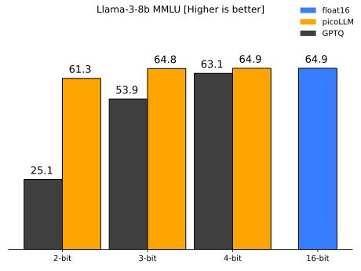

# picoLLM Inference Engine

[](https://github.com/Picovoice/picollm/releases)
[](https://github.com/Picovoice/picollm/)

[](https://repo1.maven.org/maven2/ai/picovoice/picollm-android/)
[](https://www.npmjs.com/package/@picovoice/picollm-web)
[](https://cocoapods.org/pods/picoLLM-iOS)<!-- markdown-link-check-disable-line -->
[](https://pypi.org/project/picollm/)

Made in Vancouver, Canada by [Picovoice](https://picovoice.ai)

[](https://twitter.com/AiPicovoice)<!-- markdown-link-check-disable-line -->
[](https://www.youtube.com/channel/UCAdi9sTCXLosG1XeqDwLx7w)

picoLLM Inference Engine is a highly accurate and cross-platform SDK optimized for running compressed large language
models. picoLLM Inference Engine is:

- Accurate; picoLLM Compression improves GPTQ by [significant margins](https://picovoice.ai/blog/picollm-towards-optimal-llm-quantization/)
- Private; LLM inference runs 100% locally.
- Cross-Platform
    - Linux (x86_64), macOS (arm64, x86_64), and Windows (x86_64)
    - Raspberry Pi (5 and 4)
    - Android and iOS
    - Chrome, Safari, Edge, and Firefox
- Runs on CPU and GPU
- Free for open-weight models

## Table of Contents

- [picoLLM](#picollm-inference-engine)
    - [Table of Contents](#table-of-contents)
    - [Showcases](#showcases)
      - [Raspberry Pi](#raspberry-pi)
      - [Android](#android)
      - [iOS](#ios)
      - [Cross-Browser Local LLM](#cross-browser-local-llm)
      - [Llama-3-70B-Instruct on GeForce RTX 4090](#llama-3-70b-instruct-on-geforce-rtx-4090)
      - [Local LLM-Powered Voice Assistant on Raspberry Pi](#local-llm-powered-voice-assistant-on-raspberry-pi)
      - [Local Llama-3-8B-Instruct Voice Assistant on CPU](#local-llama-3-8b-instruct-voice-assistant-on-cpu)
    - [Accuracy](#accuracy)
    - [Models](#models)
    - [AccessKey](#accesskey)
    - [Demos](#demos)
        - [Python](#python-demos)
        - [Node.js](#nodejs-demos)
        - [Android](#android-demos)
        - [iOS](#ios-demos)
        - [Web](#web-demos)
        - [C](#c-demos)
    - [SDKs](#sdks)
        - [Python](#python-sdk)
        - [Node.js](#nodejs-sdk)
        - [Android](#android-sdk)
        - [iOS](#ios-sdk)
        - [Web](#web-sdk)
        - [C](#c-sdk)
    - [Releases](#releases)

## Showcases

### Raspberry Pi

[](https://www.youtube.com/watch?v=CeKPXZ_8hkI)

### Android

[](https://www.youtube.com/watch?v=XeUMkue-5lI)

### iOS

[](https://www.youtube.com/watch?v=dNK5esdkI0Y)

### Cross-Browser Local LLM

[Live Demo — Works offline!](https://picovoice.ai/picollm/)

### Llama-3-70B-Instruct on GeForce RTX 4090

[](https://www.youtube.com/watch?v=4mcVwbOOIqk)

### Local LLM-Powered Voice Assistant on Raspberry Pi

[](https://www.youtube.com/watch?v=GEndT3RGRvw)

### Local Llama-3-8B-Instruct Voice Assistant on CPU

[](https://www.youtube.com/watch?v=uV0GlXDFSPw)

## Accuracy

picoLLM Compression is a novel large language model (LLM) quantization algorithm developed within Picovoice. Given a task-specific cost function, picoLLM Compression automatically learns the optimal bit allocation strategy across and within LLM's weights. Existing techniques require a fixed bit allocation scheme, which is subpar.

For example, picoLLM Compression recovers MMLU score degradation of widely adopted GPTQ by 91%, 99%, and 100% at 2, 3, 
and 4-bit settings. The figure below depicts the MMLU comparison between picoLLM and GPTQ for Llama-3-8b [[1]](https://picovoice.ai/blog/picollm-towards-optimal-llm-quantization/).



## Models

picoLLM Inference Engine supports the following open-weight models. The models are on
[Picovoice Console](https://console.picovoice.ai/).

- Gemma
    - `gemma-2b`
    - `gemma-2b-it`
    - `gemma-7b`
    - `gemma-7b-it`
- Llama-2
    - `llama-2-7b`
    - `llama-2-7b-chat`
    - `llama-2-13b`
    - `llama-2-13b-chat`
    - `llama-2-70b`
    - `llama-2-70b-chat`
- Llama-3
    - `llama-3-8b`
    - `llama-3-8b-instruct`
    - `llama-3-70b`
    - `llama-3-70b-instruct`
- Mistral
    - `mistral-7b-v0.1`
    - `mistral-7b-instruct-v0.1`
    - `mistral-7b-instruct-v0.2`
- Mixtral
    - `mixtral-8x7b-v0.1`
    - `mixtral-8x7b-instruct-v0.1`
- Phi-2
    - `phi2`

## AccessKey

AccessKey is your authentication and authorization token for deploying Picovoice SDKs, including picoLLM. Anyone who is
using Picovoice needs to have a valid AccessKey. You must keep your AccessKey secret. You would need internet
connectivity to validate your AccessKey with Picovoice license servers even though the LLM inference is running 100%
offline and completely free for open-weight models. Everyone who signs up for
[Picovoice Console](https://console.picovoice.ai/) receives a unique AccessKey.

## Demos

### Python Demos

Install the demo package:

```console
pip3 install picollmdemo
```

Run the following in the terminal:

```console
picollm_demo_completion --access_key ${ACCESS_KEY} --model_path ${MODEL_PATH} --prompt ${PROMPT}
```

Replace `${ACCESS_KEY}` with yours obtained from Picovoice Console, `${MODEL_PATH}` with the path to a model file
downloaded from Picovoice Console, and `${PROMPT}` with a prompt string.

For more information about Python demos go to [demo/python](demo/python/README.md).

### Node.js Demos

Install the demo package:

```console
yarn global add @picovoice/picollm-node-demo
```

Run the following in the terminal:

```console
picollm-completion-demo --access_key ${ACCESS_KEY} --model_path ${MODEL_PATH} --prompt ${PROMPT}
```

Replace `${ACCESS_KEY}` with yours obtained from Picovoice Console, `${MODEL_PATH}` with the path to a model file
downloaded from Picovoice Console, and `${PROMPT}` with a prompt string.

For more information about Node.js demos go to [Node.js demo](./demo/nodejs).

### Android Demos

Using Android Studio, open the [Completion demo](demo/android/Completion) as an Android project, copy your AccessKey into MainActivity.java, and run the application.

To learn about how to use picoLLM in a chat application, try out the [Chat demo](demo/android/Chat).

For more information about Android demos go to [demo/android](demo/android/README.md).

### iOS Demos

To run the completion demo, go to [demo/ios/Completion](demo/ios/Completion) and run:

```console
pod install
```

Replace `let ACCESS_KEY = "${YOUR_ACCESS_KEY_HERE}"` in the file [VieModel.swift](demo/ios/Completion/PicoLLMCompletionDemo/ViewModel.swift) with your AccessKey obtained from [Picovoice Console](https://console.picovoice.ai/).

Then, using [Xcode](https://developer.apple.com/xcode/), open the generated `PicoLLMCompletionDemo.xcworkspace` and run the application.

To learn about how to use picoLLM in a chat application, try out the [Chat demo](demo/ios/Chat).

For more information about iOS demos go to [demo/ios](demo/ios/README.md).

### Web Demos

From [demo/web](demo/web) run the following in the terminal:

```console
yarn
yarn start
```

(or)

```console
npm install
npm run start
```

Open `http://localhost:5000` in your browser to try the demo.

### C Demos

Build the demo:

```console
cmake -S demo/c/ -B demo/c/build && cmake --build demo/c/build
```

Run the demo:

```console
./demo/c/build/picollm_demo_completion -a ${ACCESS_KEY} -l ${LIBRARY_PATH} -m ${MODEL_FILE_PATH} -p ${PROMPT}
```

Replace `${ACCESS_KEY}` with yours obtained from Picovoice Console, `${LIBRARY_PATH}` with the path to the shared
library file located in the [lib](lib) directory, `${MODEL_FILE_PATH}` with the path to a model file downloaded from
Picovoice Console, and `${PROMPT}` with a prompt string.

For more information about C demos go to [demo/c](demo/c/README.md).

## SDKs

### Python SDK

Install the Python SDK:

```console
pip3 install picollm
```

Create an instance of the engine and generate a prompt completion:

```python
import picollm

pllm = picollm.create(
    access_key='${ACCESS_KEY}',
    model_path='${MODEL_PATH}')

res = pllm.generate('${PROMPT}')
print(res.completion)
```

Replace `${ACCESS_KEY}` with yours obtained from Picovoice Console, `${MODEL_PATH}` to the path to a model file
downloaded from Picovoice Console, and `${PROMPT}` to a prompt string. Finally, when done be sure to explicitly release
the resources using `pllm.release()`.

### Node.js SDK

Install the Node.js SDK:

```console
yarn add @picovoice/picollm-node
```

Create instances of the picoLLM class:

```javascript
const PicoLLM = require("@picovoice/picollm-node");
const pllm = new PicoLLM('${ACCESS_KEY}', '${MODEL_PATH}');

const res = pllm.generate('${PROMPT}');
console.log(res.completion);
```

Replace `${ACCESS_KEY}` with yours obtained from Picovoice Console, `${MODEL_PATH}` to the path to a model file
downloaded from Picovoice Console, and `${PROMPT}` to a prompt string. Finally, when done be sure to explicitly release
the resources using `pllm.release()`.

### Android SDK

Create an instance of the inference engine and generate a prompt completion:

```java
import ai.picovoice.picollm.*;

try {
    PicoLLM picollm = new PicoLLM.Builder()
        .setAccessKey("${ACCESS_KEY}")
        .setModelPath("${MODEL_PATH}")
        .build();
    PicoLLMCompletion res = picollm.generate(
        "${PROMPT}",
        new PicoLLMGenerateParams.Builder().build());
} catch (PicoLLMException e) { }
```

Replace `${ACCESS_KEY}` with your `AccessKey` from Picovoice Console, `${MODEL_PATH}` to the path to a model file
downloaded from Picovoice Console, and `${PROMPT}` to a prompt string. Finally, when done be sure to explicitly release
the resources using `picollm.delete()`.

### iOS SDK

Create an instance of the engine and generate a prompt completion:

```swift
import PicoLLM

let pllm = try PicoLLM(
    accessKey: "${ACCESS_KEY}",
    modelPath: "${MODEL_PATH}")

let res = pllm.generate(prompt: "${PROMPT}")
print(res.completion)
```

Replace `${ACCESS_KEY}` with yours obtained from Picovoice Console, `${MODEL_PATH}` to the path to a model file
downloaded from Picovoice Console, and `${PROMPT}` to a prompt string.

### Web SDK

Install the web SDK using yarn:

```console
yarn add @picovoice/picollm-web
```

or using npm:

```console
npm install --save @picovoice/picollm-web
```

Create an instance of the engine using `PicoLLMWorker` and transcribe an audio file:

```typescript
import { PicoLLMWorker } from "@picovoice/picollm-web";

const picoLLMModel = {
  modelFile: '${MODEL_FILE}'
}

const picoLLM = await PicoLLMWorker.create(
  "${ACCESS_KEY}",
  picoLLMModel
);

const res = await picoLLM.generate(`${PROMPT}`);
console.log(res.completion);
```

Replace `${ACCESS_KEY}` with yours obtained from [Picovoice Console](https://console.picovoice.ai/), `${MODEL_FILE}` with the contents of the model file as `File`, `Blob` or `URL (path to model file)` format and `${PROMPT}` with a prompt string. Finally, when done release the resources using `picoLLM.release()`.

### C SDK

Create an instance of the engine and generate a prompt completion:

```c
pv_picollm_t *pllm = NULL;
pv_picollm_init(
    "${ACCESS_KEY}",
    "${MODEL_PATH}",
    "best",
    &pllm);

pv_picollm_usage_t usage;
pv_picollm_endpoint_t endpoint;
int32_t num_completion_tokens;
pv_picollm_completion_token_t *completion_tokens;
char *output;
pv_picollm_generate(
    pllm,
    "${PROMPT}",
    -1,    // completion_token_limit
    NULL,  // stop_phrases
    0,     // num_stop_phrases
    -1,    // seed
    0.f,   // presence_penalty
    0.f,   // frequency_penalty
    0.f,   // temperature
    1.f,   // top_p
    0,     // num_top_choices
    NULL,  // stream_callback
    NULL,  // stream_callback_context
    &usage,
    &endpoint,
    &completion_tokens,
    &num_completion_tokens,
    &output);
printf("%s\n", output);
```

Replace `${ACCESS_KEY}` with yours obtained from Picovoice Console, `${MODEL_PATH}` to the path to a model file
downloaded from Picovoice Console, and `${PROMPT}` to a prompt string.

Finally, when done, be sure to release the resources explicitly:

```c
pv_picollm_delete(pllm);
```

## Releases
